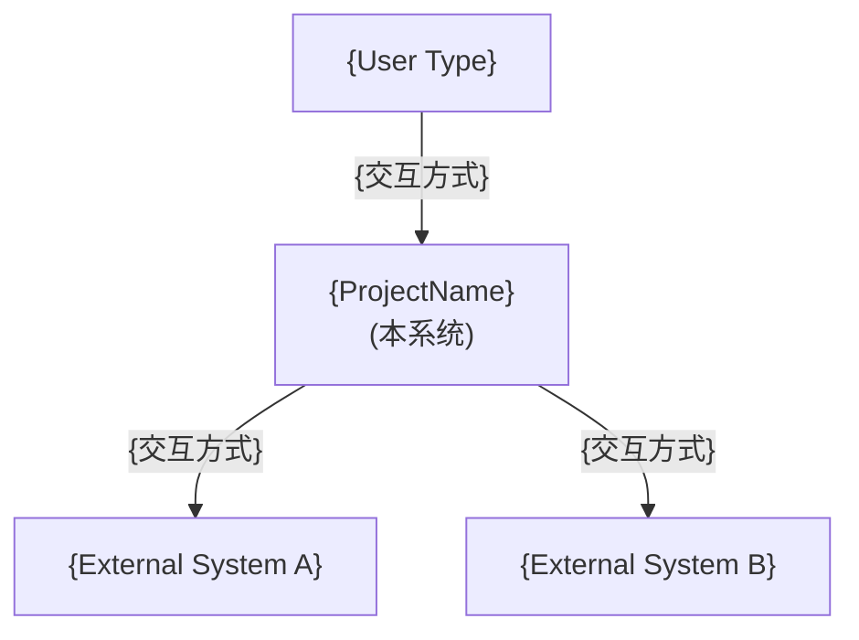
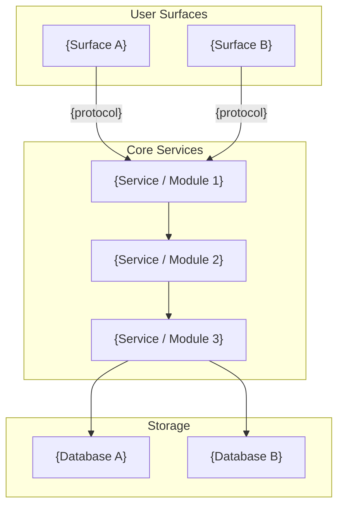
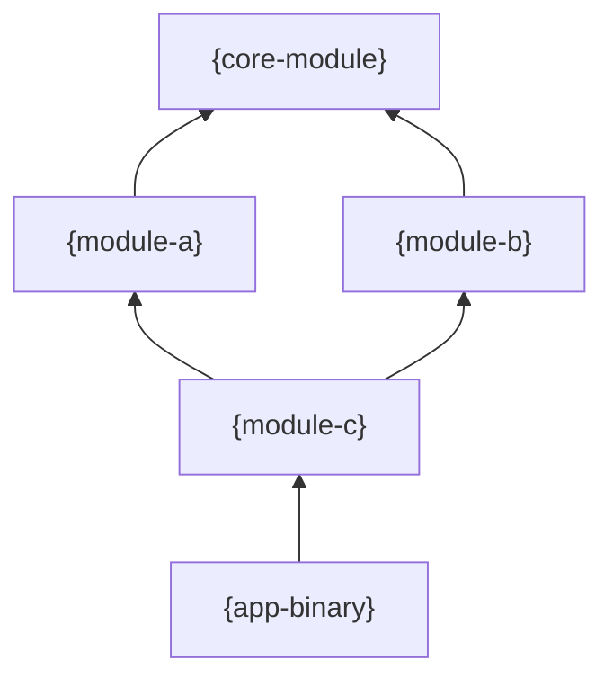
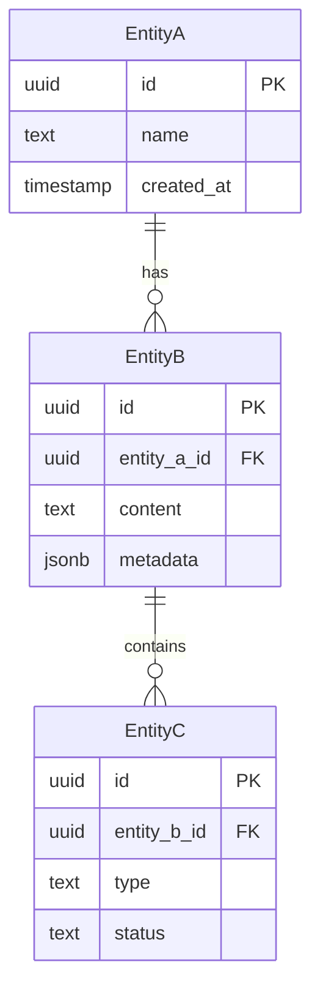
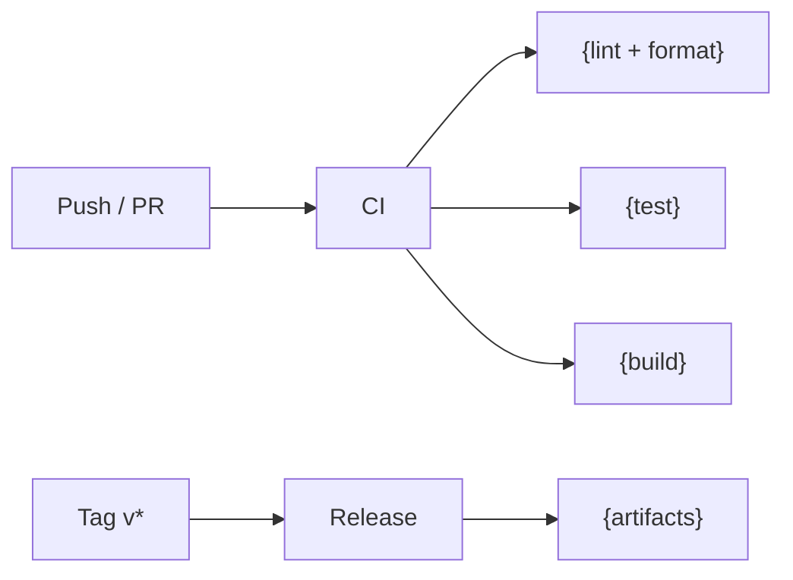

# {ProjectName} — Architecture Design Document

> **Version**: 1.0-draft
> **Date**: {YYYY-MM-DD}
> **Status**: Proposed | Accepted | Superseded
> **Authors**: {Author}

---

## Table of Contents

- [Part I: WHY — Problem Space](#part-i-why--problem-space)
  - [1. Context & Problem Statement](#1-context--problem-statement)
  - [2. Constraints & Assumptions](#2-constraints--assumptions)
  - [3. Design Philosophy](#3-design-philosophy)
- [Part II: WHAT — Solution Space](#part-ii-what--solution-space)
  - [4. High-Level Architecture](#4-high-level-architecture)
  - [5. Key Design Patterns](#5-key-design-patterns)
  - [6. Module Breakdown](#6-module-breakdown)
  - [7. Data Model](#7-data-model)
  - [8. API & Interface Contracts](#8-api--interface-contracts)
- [Part III: HOW — Cross-Cutting & Operations](#part-iii-how--cross-cutting--operations)
  - [9. Cross-Cutting Concerns](#9-cross-cutting-concerns)
  - [10. Deployment & Infrastructure](#10-deployment--infrastructure)
- [Part IV: GOVERNANCE — Decisions & Evolution](#part-iv-governance--decisions--evolution)
  - [11. Quality Attributes](#11-quality-attributes)
  - [12. Architecture Decision Records](#12-architecture-decision-records)
  - [13. Risks & Open Questions](#13-risks--open-questions)
  - [14. Evolution Roadmap](#14-evolution-roadmap)

---

# Part I: WHY — Problem Space

## 1. Context & Problem Statement

> **Think**: 如果不建这个系统，用户/团队今天怎么解决这个问题？痛点到底在哪？

### 1.1 Problem

{用 2-3 句话描述核心问题。聚焦于用户/业务的痛点，而非技术方案。}

### 1.2 Target Users

| User Type | Needs | Current Alternative |
|---|---|---|
| {用户类型 A} | {核心诉求} | {现有替代方案及其不足} |
| {用户类型 B} | {核心诉求} | {现有替代方案及其不足} |

### 1.3 Key Scenarios

1. **{场景名}** — {用一句话描述端到端的用户场景}
2. **{场景名}** — {同上}
3. **{场景名}** — {同上}

---

## 2. Constraints & Assumptions

> **Think**: 哪些是我们无法改变的硬边界？哪些是我们假设为真、但未来可能翻转的前提？

### 2.1 Constraints

| Type | Constraint | Impact |
|---|---|---|
| Technical | {e.g. 必须兼容现有 X 系统} | {对架构选择的影响} |
| Team | {e.g. 团队 3 人，无 Rust 经验} | {影响技术选型和学习曲线} |
| Business | {e.g. 3 个月内上线 MVP} | {影响 build vs buy 决策} |
| Regulatory | {e.g. 数据不出境} | {影响部署和存储方案} |

### 2.2 Assumptions

> 当这些假设不再成立时，相关架构决策需要重新审视。

- [ ] {假设 1，e.g. 初期用户量 < 1000}
- [ ] {假设 2，e.g. LLM 供应商 API 保持向后兼容}
- [ ] {假设 3，e.g. 团队在 Q2 前扩充到 5 人}

---

## 3. Design Philosophy

> **Think**: 每条原则的背面是什么？如果你没有放弃任何东西，它就不是一个真正的原则。

**"{一句话核心原则}"**

### Trade-off Spectrum

每条原则是在一个光谱上的有意识位置选择：

```
{Principle A}  ◆─────────○  {Principle A'}
               ↑ 我们选这里，因为 {理由}

{Principle B}  ○─────────◆  {Principle B'}
                          ↑ 我们选这里，因为 {理由}

{Principle C}  ───◆──────○  {Principle C'}
                  ↑ 我们选中偏左，因为 {理由}
```

### Principles

| Principle | We Choose | Over | Because |
|---|---|---|---|
| **{原则1}** | {我们选的} | {我们放弃的} | {为什么} |
| **{原则2}** | {我们选的} | {我们放弃的} | {为什么} |
| **{原则3}** | {我们选的} | {我们放弃的} | {为什么} |

---

# Part II: WHAT — Solution Space

## 4. High-Level Architecture

> **Think**: 一个从未见过这个系统的工程师，看完这张图能否在 30 秒内说出系统的主要组成部分和它们之间的关系？

### 4.1 System Context (C4 Level 1)



### 4.2 Container Diagram (C4 Level 2)



### 4.3 Key Data Flows

> 用多条数据流覆盖核心场景和关键异常路径。

**Flow 1 — {场景名（阳光路径）}**：

1. {Step 1}
2. {Step 2}
3. {Step 3}
4. {Step 4}

**Flow 2 — {场景名（异常/降级路径）}**：

1. {Step 1}
2. {Step 2 — 故障发生}
3. {Step 3 — 降级行为}

---

## 5. Key Design Patterns

> **Think**: 你能叫出你用的模式的名字吗？如果叫不出，可能你还没想清楚。

| Pattern | Applied To | Rationale |
|---|---|---|
| {e.g. Hexagonal / Ports & Adapters} | {Core 与外部的隔离} | {为什么这个问题适合这个模式} |
| {e.g. Event-Driven} | {模块间通信} | {为什么} |
| {e.g. Strategy / Trait-based} | {可替换子系统} | {为什么} |
| {e.g. Transport Abstraction} | {多平台统一接口} | {为什么} |

---

## 6. Module Breakdown

### Dependency Graph



### Feature Flags / Build Variants

| Module | Feature | Default | Description |
|---|---|---|---|
| `{module}` | `{flag}` | yes/no | {说明} |

---

### 6.1 {Module Name}

> **Think**: 如果这个模块明天被替换，需要改动多少个其他模块？如果 > 2，边界可能划得不对。

**边界理由**：{为什么这是一个独立模块而不是另一个模块的一部分？它封装了什么变化？}

**职责**：{一句话描述}

**核心接口**：

```{language}
// 定义该模块的抽象接口/trait/interface
```

**实现清单**：

| Implementation | Transport | Notes |
|---|---|---|
| {Impl A} | {协议} | {备注} |
| {Impl B} | {协议} | {备注} |

---

### 6.2 {Module Name}

> 对每个核心模块重复 6.1 的结构：边界理由 → 职责 → 接口 → 实现表

---

## 7. Data Model

> **Think**: 先问"系统需要记住什么？"再问"怎么存"。Schema 是结果，不是起点。

### 7.1 Entity Relationship



### 7.2 Schema Details

**{Entity} metadata** (JSONB):
```jsonc
{
  "field_a": "value",
  "field_b": { "nested": true }
}
```

**Enum values**：`{field}`: `value_a`, `value_b`, `value_c`

### 7.3 Mode-Specific Behavior

| Aspect | {Mode A} | {Mode B} |
|---|---|---|
| Database | {SQLite / Mongo / ...} | {PostgreSQL / ...} |
| Auth | {None / Basic} | {JWT / OAuth} |
| Search | {方案} | {方案} |

---

## 8. API & Interface Contracts

> **Think**: API 是你对外的承诺。一旦发布就是债务。先想清楚契约，再写实现。

### 8.1 REST API

所有端点前缀 `/api/v1/`，标准状态码：

- `200` — Success / `201` — Created / `204` — No Content
- `400` — Validation Error / `401` — Unauthorized / `404` — Not Found
- `429` — Rate Limited / `500` — Internal Error

**Error format**:
```json
{
  "error": {
    "code": "ERROR_CODE",
    "message": "Human readable message",
    "details": {}
  }
}
```

**Endpoints**:

```
GET    /api/v1/{resources}           List
POST   /api/v1/{resources}           Create
GET    /api/v1/{resources}/:id       Get
PATCH  /api/v1/{resources}/:id       Update
DELETE /api/v1/{resources}/:id       Delete
```

**Pagination**: `?cursor=<id>&limit=20`，响应包含 `next_cursor`。

### 8.2 Real-time Protocol

| Direction | Type | Description |
|---|---|---|
| Client → Server | `{event.action}` | {说明} |
| Server → Client | `{event.action}` | {说明} |

**Message format**:
```jsonc
{
  "type": "{event.action}",
  "id": "{msg-uuid}",
  "payload": { ... }
}
```

---

# Part III: HOW — Cross-Cutting & Operations

## 9. Cross-Cutting Concerns

> **Think**: 这些关注点横穿所有模块。如果每个模块各自处理，就会不一致。统一策略比分散实现重要。

### 9.1 Security

**Principles**: Defense in depth / Least privilege / Secure by default

| Threat | Mitigation |
|---|---|
| {威胁1} | {缓解措施} |
| {威胁2} | {缓解措施} |
| {威胁3} | {缓解措施} |

### 9.2 Observability

| Layer | Tool / Strategy | What We Capture |
|---|---|---|
| **Logging** | {e.g. structured JSON via tracing} | {关键事件、错误、审计日志} |
| **Metrics** | {e.g. Prometheus / StatsD} | {延迟、吞吐、错误率、业务指标} |
| **Tracing** | {e.g. OpenTelemetry} | {跨模块请求链路} |
| **Alerting** | {e.g. PagerDuty / Grafana} | {触发条件和响应流程} |

### 9.3 Error Strategy

> **Think**: 用户看到的错误和开发者看到的错误不应该是同一个东西。

| Error Class | Example | Retry? | User-Visible? | Action |
|---|---|---|---|---|
| Transient | Network timeout | Yes (exponential backoff) | "请稍后重试" | Auto-retry up to N times |
| Permanent | Invalid input | No | 具体错误信息 | Return 4xx |
| Infrastructure | DB down | Yes (with circuit breaker) | "服务暂时不可用" | Alert + graceful degradation |
| Business Logic | Quota exceeded | No | 具体提示 | Return domain error |

**Degradation strategy**: {当核心依赖不可用时，系统如何降级运行？}

### 9.4 Configuration

```
Priority (highest to lowest):
  1. Environment variables       {敏感值、部署环境差异}
  2. Runtime config / flags      {Feature flags、A/B 测试}
  3. User config file            {用户级偏好}
  4. Default config              {合理默认值}
```

**Sensitive values**: 仅通过环境变量注入，永不写入配置文件或代码仓库。

---

## 10. Deployment & Infrastructure

### 10.1 Directory Structure

```
{project}/
├── {src}/
│   ├── {module-a}/           # {职责}
│   ├── {module-b}/           # {职责}
│   └── {module-c}/           # {职责}
├── {apps}/
│   ├── {app-1}/              # {说明}
│   └── {app-2}/              # {说明}
├── {config}/
│   └── {config-file}         # {说明}
├── {deploy}/
│   ├── Dockerfile
│   └── docker-compose.yml
└── .github/
    └── workflows/
        ├── ci.yml
        └── release.yml
```

### 10.2 CI/CD Pipeline



### 10.3 Release Artifacts

| Artifact | Description |
|---|---|
| `{artifact-1}` | {说明} |
| `{artifact-2}` | {说明} |

---

# Part IV: GOVERNANCE — Decisions & Evolution

## 11. Quality Attributes

> **Think**: 当两个质量属性冲突时，你选哪边？不做选择本身也是选择（只不过是无意识的）。

### 11.1 Trade-off Pairs

| Attribute A | ← Preference → | Attribute B | Rationale |
|---|---|---|---|
| Consistency | **A** ← ○ | Availability | {为什么} |
| Security | **A** ← ○ | Usability | {为什么} |
| Performance | ○ → **B** | Maintainability | {为什么} |
| Feature richness | ○ → **B** | Simplicity | {为什么} |

### 11.2 Measurable Targets

| Requirement | Target | Measurement |
|---|---|---|
| {e.g. 冷启动时间} | < {数值} | {度量方式} |
| {e.g. 内存占用} | < {数值} | {度量方式} |
| {e.g. API 延迟} | < {数值} p99 | {度量方式} |
| {e.g. 并发量} | {数值}+ | {度量方式} |

---

## 12. Architecture Decision Records

> **Think**: 六个月后你会忘记为什么做了这个选择。ADR 是写给未来的自己和接手的人的。

### ADR-001: {Decision Title}

| | |
|---|---|
| **Status** | Proposed / Accepted / Deprecated |
| **Context** | {为什么需要做这个决策} |
| **Decision** | {选择了什么} |
| **Rationale** | {为什么这么选} |
| **Trade-off** | {选择带来的代价} |
| **Alternatives** | {考虑过但未选的方案} |

### ADR-002: {Decision Title}

> 对每个重大架构决策重复以上格式

---

## 13. Risks & Open Questions

> **Think**: 你最担心什么？哪些假设还没验证？诚实地写下来比假装一切确定更专业。

### 13.1 Known Risks

| Risk | Impact | Likelihood | Mitigation / Next Step |
|---|---|---|---|
| {风险1} | High / Med / Low | High / Med / Low | {缓解措施或下一步验证计划} |
| {风险2} | | | |
| {风险3} | | | |

### 13.2 Open Questions

- [ ] {未解决的设计问题 1，e.g. 消息队列选型待 benchmark}
- [ ] {未解决的设计问题 2，e.g. 离线优先是否为硬需求？需用户调研}
- [ ] {未解决的设计问题 3}

---

## 14. Evolution Roadmap

> **Think**: 架构不是一次性的。什么会变？我们现在的设计是否为将来的变化留了口子？

### 14.1 Scaling Stages

| Scale | Architecture |
|---|---|
| **{阶段1}** (e.g. 单用户 / MVP) | {当前架构} |
| **{阶段2}** (e.g. 10-100 用户) | {扩展策略} |
| **{阶段3}** (e.g. 1K+ 用户) | {进一步扩展} |

### 14.2 Anticipated Changes

| Change | When | Architecture Impact | Preparation |
|---|---|---|---|
| {e.g. 新增移动端} | {时间线} | {需要什么改动} | {现在需要为此做什么} |
| {e.g. 多语言支持} | {时间线} | {需要什么改动} | {现在需要为此做什么} |
| {e.g. 替换存储层} | {时间线} | {需要什么改动} | {现在的抽象层是否足够} |

### 14.3 Migration (from Previous Version)

> 仅在版本迭代时需要。

| Aspect | Strategy |
|---|---|
| {Config} | {迁移策略} |
| {Database} | {迁移策略} |
| {API} | {兼容性策略} |

---

*This is a living document. It captures the current architectural intent and the
reasoning behind it. When reality diverges from this document, update the document
— not the other way around. Architecture changes require an ADR amendment.*
